# Springfield Protocol: Character Map

All nine characters that make up the Springfield Protocol, their roles, and how they interact.

---

## Discovery Track Characters

### Troy McClure - Chief Discovery Officer
**Track:** Discovery  
**Strength:** Intelligence gathering, narrative synthesis, pragmatic decision-making  
**Flaw:** Chases compelling stories, oversimplifies complex problems, can decide too fast

**Responsibilities:**
- Conduct interviews and root-cause analysis (Five Whys)
- Gemba walk: investigate docs, code, systems for context
- Synthesize findings into coherent narratives
- Document unknowns and decision gates
- Stay engaged during delivery to validate assumptions

**Outputs:**
- Discovery Brief (intelligence synthesis)
- Unknowns Map (explicit uncertainty capture)
- Recommendation to proceed, spike, or defer

**See:** [[troy-mcclure.md]]

---

### Frink - Architect & Pattern Specialist
**Track:** Discovery (gate-keeper)  
**Strength:** Technical coherence, pattern recognition, architectural constraints  
**Flaw:** Can get lost in perfectionism, may over-architect simple problems

**Responsibilities:**
- Review Discovery Brief for architectural alignment
- Identify relevant ADRs and patterns to follow
- Validate that proposed solutions fit existing constraints
- Propose technical approaches that honor architecture
- Flag conflicts between feature request and ADRs

**Inputs from:** Troy (Discovery Brief)  
**Outputs to:** Marge (validation passed/failed)  
**Relationship with Ralph:** Provides architectural guardrails; watches implementation for coherence

**See:** [[frink.md]] (stub)

---

### Marge - Empathy & Guardrails
**Track:** Discovery & Delivery (gate-keeper)  
**Strength:** Stakeholder alignment, user advocacy, risk acknowledgment  
**Flaw:** Can delay decisions waiting for perfect consensus, risk-averse

**Responsibilities (Discovery):**
- Confirm user needs match the problem statement
- Get stakeholder acknowledgment of unknowns and risks
- Validate roadmap fit and business priority
- Gate the move from Discovery to Delivery

**Responsibilities (Delivery):**
- Monitor PR-to-Merge flow
- Ensure implementation solves the original user need
- Catch scope creep or requirement drift
- Gate merge decisions

**Inputs from:** Frink (validated architecture), Ralph (implementation)  
**Outputs to:** Lisa (approved feature brief), team (merge decisions)

**See:** [[marge.md]] (stub)

---

## Delivery Track Characters

### Lisa - Strategic Planner & Orchestrator
**Track:** Delivery (manager)  
**Strength:** Strategic thinking, task orchestration, clarity  
**Flaw:** Can get too focused on plan, may resist adaptive replanning

**Responsibilities:**
- Translate Feature Brief into PLAN.md (epics and milestones)
- Break epics into TODO.md tasks for Ralph
- Orchestrate parallel work across multiple tasks
- Monitor plan health and flag blockers
- Adjust plan based on mid-sprint learnings from Troy

**Inputs from:** Marge (approved feature brief)  
**Outputs to:** Ralph (TODO.md), team (PLAN.md status)  
**Relationship with Troy:** Receives learning signals during delivery; may adjust plan mid-sprint

**See:** [[lisa.md]] (stub)

---

### Ralph - TDD Executor & Implementation Agent
**Track:** Delivery (executor)  
**Strength:** Autonomous execution, test-first discipline, velocity  
**Flaw:** Can get lost in details, may miss "why" questions

**Responsibilities:**
- Execute tasks from TODO.md using strict TDD practices
- Write tests first, implement second
- Maintain 95%+ code coverage
- Implement zero-change imports (brownfield work)
- Flag when assumptions from feature brief don't hold up in practice

**Inputs from:** Lisa (TODO.md tasks)  
**Outputs to:** Bart (implementation for review), team (PR)  
**Relationship with Troy:** Troy watches Ralph's work and picks up learning signals

**See:** [[ralph.md]] (stub)

---

### Bart - Adversarial Reviewer & Breaker
**Track:** Delivery (critic)  
**Strength:** Finding edge cases, security holes, lazy shortcuts  
**Flaw:** Can be destructive without offering solutions, may nitpick unnecessarily

**Responsibilities:**
- Review Ralph's implementation for quality issues
- Try to "break" the code: find security holes, edge cases, performance problems
- Challenge assumptions and shortcuts
- Ensure adherence to patterns from Frink
- Recommend fixes or escalate to Ralph for rework

**Inputs from:** Ralph (PR/implementation)  
**Outputs to:** Herb (validated implementation)  
**Relationship with Ralph:** Constructive adversary; pushes for quality

**See:** [[bart.md]] (stub)

---

### Herb - Quality Engineer & Coverage Enforcer
**Track:** Delivery (verifier)  
**Strength:** Test coverage, quality metrics, zero-change imports  
**Flaw:** Can enforce rules mechanically without understanding context, perfectionist

**Responsibilities:**
- Enforce 95%+ test coverage requirement
- Validate mock-first testing strategy
- Ensure zero-change brownfield imports
- Check for integration test quality
- Recommend coverage improvements

**Inputs from:** Bart (approved implementation)  
**Outputs to:** Marge (quality validation passed/failed)  
**Relationship with Ralph:** Provides feedback on coverage; recommends testing improvements

**See:** [[herb.md]] (stub)

---

## Supporting Characters

### Wiggum - Triage Officer & Issue Bridge
**Track:** Entry point (before Discovery)  
**Strength:** Issue analysis, Definition of Ready enforcement, ecosystem investigation  
**Flaw:** Can get stuck in analysis without moving issues forward

**Responsibilities:**
- Assess incoming issues (GitHub, Slack, user feedback)
- Enforce Definition of Ready (issue has enough context to explore)
- Perform ecosystem investigation (what systems does this affect?)
- Triage to appropriate track (discovery vs. routine maintenance)
- Hand off to Troy (if discovery needed) or directly to Lisa (if clear)

**Outputs to:** Troy (issues ready for discovery) or Lisa (routine work)

**See:** [[wiggum.md]] (stub)

---

### Lovejoy - Ceremony Master & Release Agent
**Track:** Delivery (final gate)  
**Strength:** Semantic versioning, changelogs, release ceremonies  
**Flaw:** Can be ceremonial without substance, may over-document

**Responsibilities:**
- Manage semantic versioning decisions
- Generate/update CHANGELOG.md
- Orchestrate release ceremonies
- Ensure release notes communicate value to users
- Publish to registry/distribution channels

**Inputs from:** Marge (approved merge)  
**Outputs to:** Users (release)

**See:** [[lovejoy.md]] (stub)

---

## Relationship Map

### Visual: Character Interaction Network

```mermaid
graph TB
    subgraph Discovery["🔍 DISCOVERY TRACK"]
        Wiggum["🚔 Wiggum<br/>Triage Officer"]
        Troy["🎬 Troy<br/>Chief Discovery Officer"]
        Frink["🔬 Frink<br/>Architect"]
        MargeDis["💜 Marge<br/>Empathy & Guardrails"]
    end
    
    subgraph Delivery["⚙️ DELIVERY TRACK"]
        Lisa["📋 Lisa<br/>Strategic Planner"]
        Ralph["😊 Ralph<br/>TDD Executor"]
        Bart["😈 Bart<br/>Adversarial Reviewer"]
        Herb["🏥 Herb<br/>Quality Engineer"]
    end
    
    subgraph Release["🎉 RELEASE TRACK"]
        Lovejoy["⛪ Lovejoy<br/>Ceremony Master"]
    end
    
    Request["📧 Issue/Request"]
    FeatureBrief["📄 Feature Brief"]
    Users["👥 Users"]
    
    %% Discovery Flow
    Request -->|Triage & Ready?| Wiggum
    Wiggum -->|Route to Discovery| Troy
    Troy -->|Intelligence Summary| Frink
    Frink -->|Architecture Valid?| MargeDis
    MargeDis -->|User Fit OK?| FeatureBrief
    
    %% Delivery Flow
    FeatureBrief -->|Create Plan| Lisa
    Lisa -->|TODO.md Tasks| Ralph
    Ralph -->|Implementation| Bart
    Bart -->|Code Review| Herb
    Herb -->|Coverage Valid?| MargeDis
    MargeDis -->|Merge Gate| Lovejoy
    
    %% Learning Loop (during delivery)
    Ralph -.->|Signals & Learnings| Troy
    Troy -.->|Adjust Plan| Lisa
    Lisa -.->|Replan| Ralph
    
    %% Release
    Lovejoy -->|Release| Users
    
    %% Indirect Relationships
    Frink -.->|Architecture Guardrails| Ralph
    Troy -.->|References ADRs| Frink
    Troy -.->|Validates Assumptions| Herb
    
    style Discovery fill:#e1f5ff
    style Delivery fill:#f3e5f5
    style Release fill:#fff9c4
    style Request fill:#ffe0b2
    style Users fill:#c8e6c9
    style FeatureBrief fill:#ffccbc
```



### Discovery Track Flow (Sequential)
```
Issue/Request
    ↓
Wiggum (triage & Definition of Ready)
    ↓
Troy (gather intelligence, synthesize narrative)
    ↓
Frink (validate architecture)
    ↓
Marge (confirm user fit, roadmap alignment, gate decision)
    ↓
Feature Brief → Delivery Track
```

### Delivery Track Flow (Sequential)
```
Feature Brief
    ↓
Lisa (create PLAN.md epics & TODO.md tasks)
    ↓
Ralph (TDD execution)
    ↓
Bart (adversarial review)
    ↓
Herb (quality & coverage validation)
    ↓
Marge (gate merge, confirm user fit)
    ↓
Lovejoy (release ceremony)
    ↓
Users
```

### Learning Loop (During Delivery)
```
Ralph (executes, finds surprises)
    ↓
Troy (monitors, picks up signals, validates assumptions)
    ↓
Lisa (adjusts PLAN.md if needed, communicates changes)
    ↓
Continue delivery OR pivot
```

**Legend:**
- **Solid arrows (→)** = Direct flow/handoff
- **Dashed arrows (→)** = Monitoring/feedback loops during execution
- **Blue box** = Discovery Track (problem investigation)
- **Purple box** = Delivery Track (implementation)
- **Yellow box** = Release Track (publishing)

---

## Character Interactions by Scenario

### Scenario 1: Feature Request Arrives
1. **Wiggum** triages and prepares
2. **Troy** interviews and investigates
3. **Frink** validates architecture
4. **Marge** gates decision
5. **Lisa** plans delivery

### Scenario 2: Assumption Breaks During Implementation
1. **Ralph** flags in code
2. **Troy** investigates the finding
3. **Lisa** decides: pivot plan or communicate risk
4. **Marge** gates the change

### Scenario 3: Bart Finds a Security Hole
1. **Bart** flags issue
2. **Ralph** fixes
3. **Herb** validates coverage on fix
4. **Marge** approves merge

### Scenario 4: Feature Conflicts with ADR
1. **Frink** flags during feature review
2. **Troy** revisits problem framing
3. **Marge** decides: revise feature or propose ADR update
4. **Proceed** with modified understanding

---

## Summary Table

| Character | Track | Role | Gate? | Phase |
|-----------|-------|------|-------|-------|
| Wiggum | Entry | Triage Officer | Yes | Pre-Discovery |
| Troy | Discovery | Chief Discovery Officer | No | Discovery |
| Frink | Discovery | Architect | Yes | Discovery |
| Marge | Discovery/Delivery | Empathy & Guardrails | Yes | Discovery + Merge |
| Lisa | Delivery | Strategic Planner | No | Delivery Planning |
| Ralph | Delivery | TDD Executor | No | Implementation |
| Bart | Delivery | Adversarial Reviewer | No | Review |
| Herb | Delivery | Quality Engineer | Yes | Verification |
| Lovejoy | Release | Ceremony Master | No | Release |

**Gate-keepers** (can block progress):
- **Wiggum** - Definition of Ready
- **Frink** - Architecture alignment
- **Marge** - User fit & roadmap (Discovery), Merge approval (Delivery)
- **Herb** - Quality metrics (95%+ coverage)
- **Lovejoy** - Release ceremony (soft gate)

## Interaction Matrix: Who Talks to Whom?

```
          | Wiggum | Troy | Frink | Marge | Lisa | Ralph | Bart | Herb | Lovejoy |
----------|--------|------|-------|-------|------|-------|------|------|---------|
Wiggum    |        | ✓    |       |       |      |       |      |      |         |
Troy      | ✓      |      | ✓     | ✓     |      |       |      | ✓    |         |
Frink     |        | ✓    |       | ✓     | ✓    | ✓     |      |      |         |
Marge     |        | ✓    | ✓     |       | ✓    | ✓     | ✓    | ✓    | ✓       |
Lisa      |        | ✓    | ✓     | ✓     |      | ✓     |      |      | ✓       |
Ralph     |        | ✓    | ✓     | ✓     | ✓    |       | ✓    | ✓    |         |
Bart      |        |      |       | ✓     |      | ✓     |      | ✓    |         |
Herb      | ✓      | ✓    |       | ✓     |      | ✓     | ✓    |      |         |
Lovejoy   |        |      |       | ✓     | ✓    |       |      |      |         |
```

**Key Interactions:**

- **Troy is a hub** - Connects Discovery (Frink, Marge), Delivery (Ralph, Herb), and Escalation (Marge)
- **Marge is a bridge** - Connects Discovery and Delivery; final gate on both sides
- **Ralph is central executor** - Receives input from Lisa, feedback from Bart/Herb, signals to Troy
- **Bart & Herb form review pair** - Collaborate on quality (Bart finds issues, Herb validates coverage)
- **Wiggum is entry point** - Only talks to Troy; routes issues to appropriate track

---

## Next Steps

For detailed profiles of each character, see:
- **[[troy-mcclure.md]]** - Detailed profile with philosophy and workflow
- **[[frink.md]], [[lisa.md]], [[marge.md]], [[ralph.md]], [[bart.md]], [[herb.md]], [[lovejoy.md]], [[wiggum.md]]** - Individual character stubs (to be expanded)
